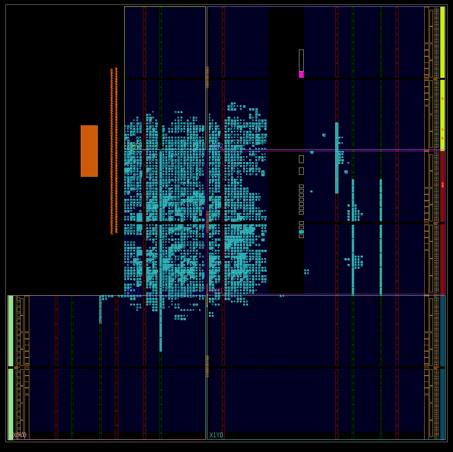
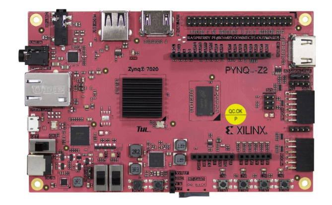

<h1>Systolic Array RTL + Firmware Project</h1>

<h3>[First Release 8x8 Systolic Array]</h3>

> Update

  Finally implemented the interrupt function after load and matmul is finished. I also made the main.c file a little bit cleaner
  by using header files for interrupt and XGPIO initialization and the matrix references.
    
  Next version would be adding new memory spaces for additional matrices in the PL fabric which would allow us to write
  multiple matrices then switch to whatever matrix we want for matrix multiplication by specifying which matrices to load
  to the registers.
    
  I am also planning to add some features to specify if the matrix to be written on to the FPGA is a weight or input matrix
  so we can "automatically" transpose the matrix. As of now, the matrix we have is transposed by default. 

  

---

<h4>Stats</h4>

<ul>PS Clock Frequency: 650 MHz</ul>
<ul>PL Clock Frequency: 100 MHz</ul>
<ul>Matrix Multiplication: 1 us latency (8x8 matmul)</ul>
<ul>Total (Write, Load, Matmul, Read): 0.042003 s</ul>

---

<h4>Source Files</h4>

> [RTL Hardware Code](https://github.com/dsa-shua/32x32-SystolicArray/tree/main/systolic-array-hardware)

> [Software Code](https://github.com/dsa-shua/32x32-SystolicArray/tree/main/systolic-array-software)

---

  
<h4>
  Data Sheets:
</h4>

> Block Diagram

  

> Floor Planning

  

> Power Summary

  

> Timing Summary

  

> Utilization Summary

  

---

<h4>
  FPGA Used: Xilinx PNYQ-Z2 FPGA 
</h4>

  

[Coupang (쿠팡) Product Link](https://www.coupang.com/vp/products/6695901022?itemId=15490388486&vendorItemId=82709739509&q=zynq&itemsCount=36&searchId=17f7af577cbd49099de4d26aae7b8046&rank=0&isAddedCart=)

[Amazon Product Link](https://www.amazon.com/Sparkle-Exclusive-Cortex-A9-Protection-Accessories/dp/B0C9HBJ5JB/ref=sr_1_13?crid=2CPY2OYQHVPN4&keywords=xilinx&qid=1707630187&sprefix=xili%2Caps%2C273&sr=8-13)

[Xilinx Website Link](https://www.xilinx.com/support/university/xup-boards/XUPPYNQ-Z2.html)

