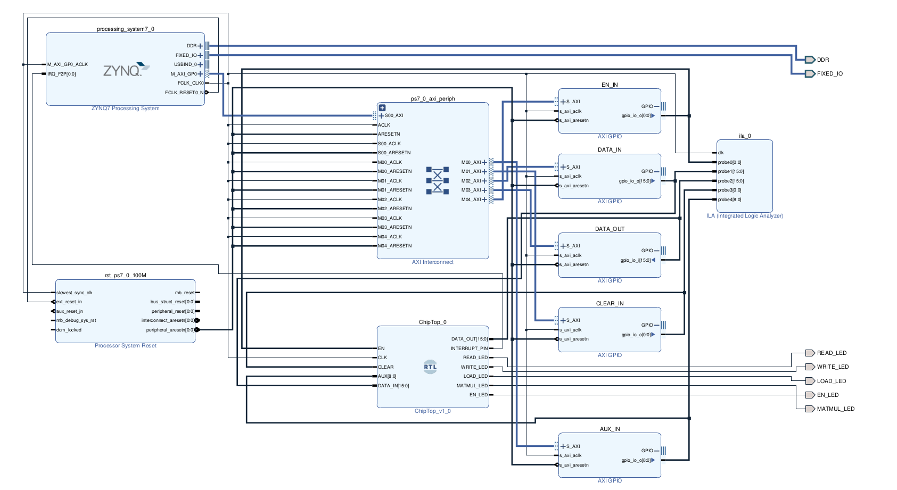
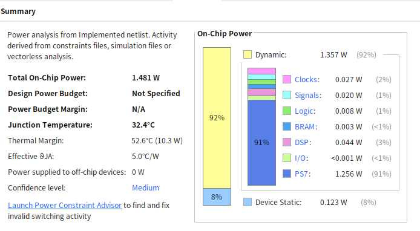
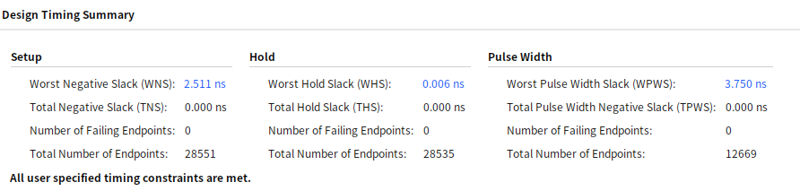
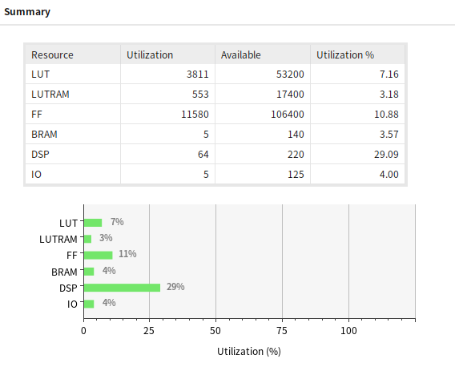

<h1>32x32 Systolic Array RTL + Firmware Project</h1>

<h3>[Project Currently Under Development]</h3>

> Update

  Currently, the hardware is complete while the software (firmware) is on its early version. Current implementation
  provides corret results for test matrix multiplications. 
    
  For now, the firmware code includes only the backbone of the planned finished code. I have included an interrupt 
  signal to be sent from the PL to PS after finishing matrix multiplication (23 clock cycles) and/or loading registers (8 clock cycles) but
  had not yet included it on the firmware. I'll do it as soon as possible. :)
    
  Note: Github Repo would not be updated for every edit on files but only for major updates only. 
  Next update would be the completed version of the systolic array software and hardware.

  

---

<h4>Source Files</h4>

> [RTL Hardware Code](https://github.com/dsa-shua/32x32-SystolicArray/tree/main/systolic-array-hardware)

> [Software Code](https://github.com/dsa-shua/32x32-SystolicArray/tree/main/systolic-array-software)

---

  
<h4>
  Data Sheets:
</h4>

> Block Diagram

  

> Floor Planning

  

> Power Summary

  

> Timing Summary

  

> Utilization Summary

  

---

<h4>
  FPGA Used: Xilinx PNYQ-Z2 FPGA 
</h4>

  

[Coupang (쿠팡) Product Link](https://www.coupang.com/vp/products/6695901022?itemId=15490388486&vendorItemId=82709739509&q=zynq&itemsCount=36&searchId=17f7af577cbd49099de4d26aae7b8046&rank=0&isAddedCart=)

[Amazon Product Link](https://www.amazon.com/Sparkle-Exclusive-Cortex-A9-Protection-Accessories/dp/B0C9HBJ5JB/ref=sr_1_13?crid=2CPY2OYQHVPN4&keywords=xilinx&qid=1707630187&sprefix=xili%2Caps%2C273&sr=8-13)

[Xilinx Website Link](https://www.xilinx.com/support/university/xup-boards/XUPPYNQ-Z2.html)

